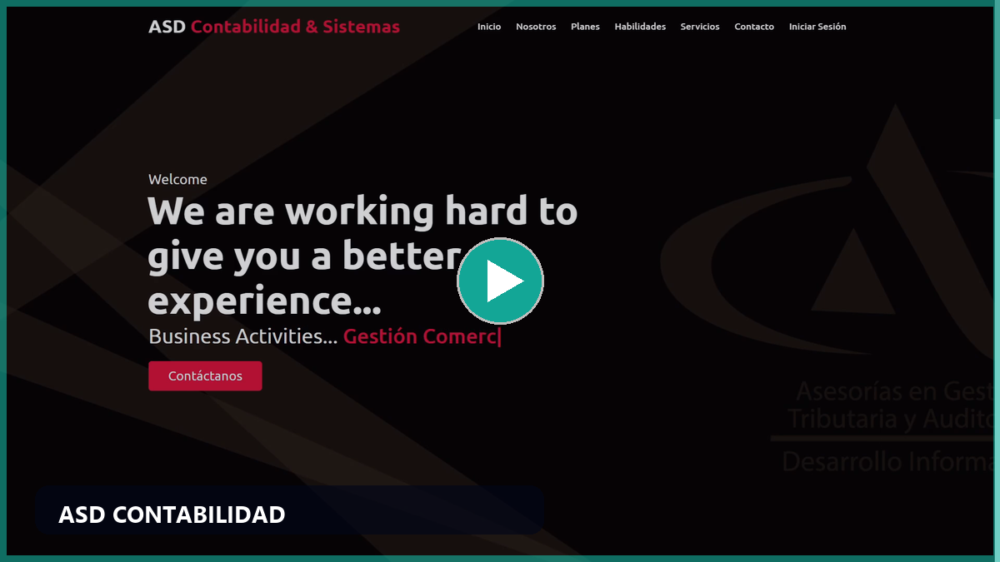
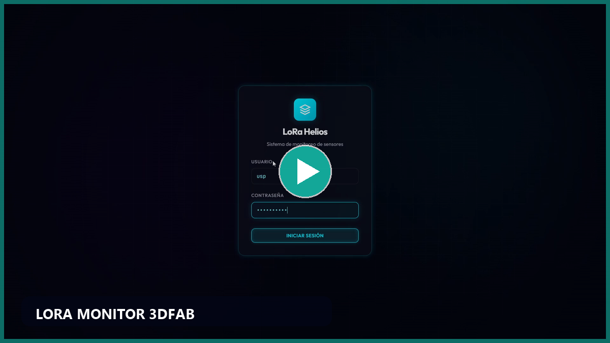
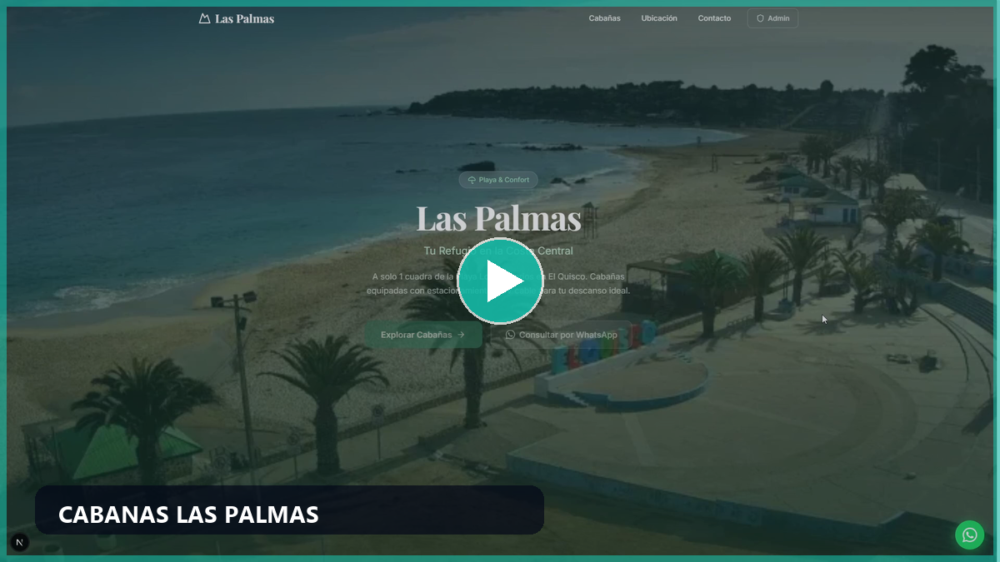
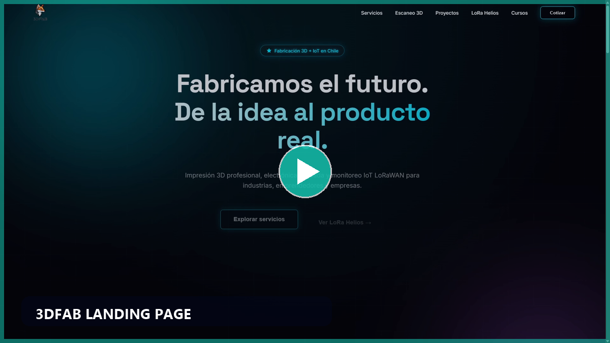
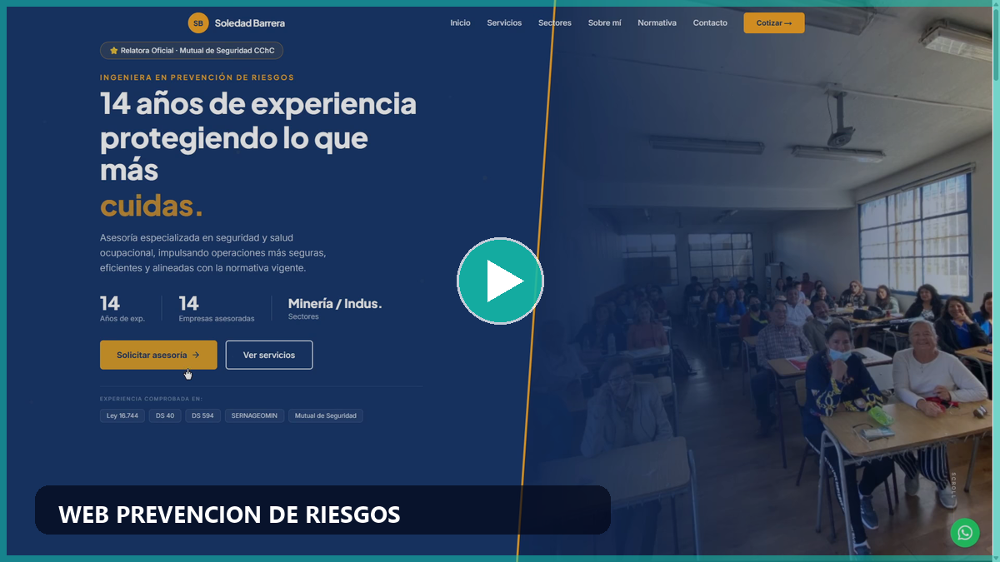

  
  
  

---

## Perfil

  Estudiante de <strong>Ingeniería Civil Informática</strong> en Chile, con foco en desarrollo full-stack,
  ciberseguridad aplicada, automatización e integración de sistemas.

<table>
  <tr>
    <td width="50%" valign="top">
      <h3>Lo que construyo</h3>
      

        Software preparado para funcionar en contextos reales: sistemas internos, plataformas web,
        APIs, aplicaciones de escritorio, soluciones IoT, bots y herramientas operativas.
      

      <ul>
        <li>Paneles administrativos y dashboards de gestión.</li>
        <li>Backends con autenticación, validación, auditoría y control de acceso.</li>
        <li>Automatizaciones para despliegue, backups y procesos repetitivos.</li>
      </ul>
    </td>
    <td width="50%" valign="top">
      <h3>Mi enfoque</h3>
      

        Me interesa que cada proyecto sea claro, mantenible y desplegable. Priorizo arquitectura,
        seguridad, trazabilidad y una experiencia de uso limpia para operación diaria.
      

      <ul>
        <li>Seguridad aplicada desde el diseño.</li>
        <li>Arquitectura simple, modular y escalable.</li>
        <li>Soluciones útiles, medibles y conectadas con necesidades reales.</li>
      </ul>
    </td>
  </tr>
</table>

  
  
  
  
  

---

## Proyectos destacados

### 01. Sistema de Gestión para Entidad Gubernamental `Confidencial`

Sistema interno de gestión administrativa para una entidad gubernamental, desarrollado con arquitectura full-stack orientada a operación real, seguridad aplicada y despliegue controlado en Windows.

- Backend con **Node.js 22, Express 5, Prisma y SQL**.
- Frontend operativo en **HTML, CSS y JavaScript vanilla**.
- Autenticación JWT, validación estricta con Zod y hardening con Helmet.
- Auditoría criptográfica con HMAC-SHA256, validación MIME real en uploads y controles de integridad.
- Automatización de despliegue, backups, servicio Windows y tareas de operación.

  
  
  
  
  
  
  
  
  

### 02. ASD Contabilidad

Portal de clientes y aplicación de escritorio con Electron para gestión documental y operación contable. Proyecto enfocado en seguridad, trazabilidad y uso productivo.

- Autenticación dual con **session auth + JWT M2M**.
- Device binding para control de dispositivos autorizados.
- Gestión documental con integridad **SHA-256** y audit logging.
- Backend Node.js/Express con MySQL, Winston, Helmet y pruebas con Jest.
- Aplicación desktop con Electron e interfaz web compatible con entorno cPanel.

  
  
  
  
  
  
  
  
  

### 03. LoRa Monitor 3DFAB

Plataforma IoT LoRaWAN con stack MERN, diseñada para monitoreo, métricas y visualización de eventos en tiempo real.

- Arquitectura modular con **React, Node.js, MongoDB y Redis**.
- Redis para caché, Pub/Sub y desacoplamiento de eventos.
- Seguridad de producción con JWT, rate limiting y separación de responsabilidades.
- Visualización de métricas con Recharts y despliegue dockerizado.
- Base preparada para operación de sensores, gateways y paneles técnicos.

  
  
  
  
  
  
  

### 04. Cabañas Las Palmas

Sistema full-stack de gestión hotelera para reservas, pasajeros, pagos, egresos y servicios extra. Combina panel administrativo, reportes operativos y landing pública.

  
  
  
  
  
  
  
  

### 05. 3DFAB Landing Page

Landing corporativa para empresa de impresión 3D e IoT, con experiencia responsive, animaciones de scroll, efecto 3D tilt y composición visual premium.

  
  
  
  
  

### 06. Web Prevención de Riesgos

Sitio profesional para servicios de prevención de riesgos, con portafolio de servicios, normativas, testimonios, contacto directo por WhatsApp y diseño responsive.

  
  
  
  

### 07. Bot Architecture & Inventory

Proyectos locales de inventario y automatización: sistemas Django, bases SQLite y arquitecturas de bots en Discord para flujos operativos pequeños y herramientas internas.

  
  
  
  

---

## Demos visuales

  Miniaturas generadas desde los proyectos reales. Cada preview abre el video de demostración.

<table>
  <tr>
    <td width="50%" align="center">
      
      <strong>ASD Contabilidad</strong>
    </td>
    <td width="50%" align="center">
      
      <strong>LoRa Monitor 3DFAB</strong>
    </td>
  </tr>
  <tr>
    <td width="50%" align="center">
      
      <strong>Cabañas Las Palmas</strong>
    </td>
    <td width="50%" align="center">
      
      <strong>3DFAB Landing Page</strong>
    </td>
  </tr>
  <tr>
    <td width="50%" align="center">
      
      <strong>Web Prevención de Riesgos</strong>
    </td>
    <td width="50%" align="center">
      <strong>Más proyectos en desarrollo</strong> 
      Inventario, automatización, bots y herramientas internas.
    </td>
  </tr>
</table>

---

## Stack técnico

<table>
  <tr>
    <td><strong>Lenguajes</strong></td>
    <td>
      
      
      
      
    </td>
  </tr>
  <tr>
    <td><strong>Frontend</strong></td>
    <td>
      
      
      
      
      
    </td>
  </tr>
  <tr>
    <td><strong>Backend</strong></td>
    <td>
      
      
      
      
    </td>
  </tr>
  <tr>
    <td><strong>Datos</strong></td>
    <td>
      
      
      
      
      
    </td>
  </tr>
  <tr>
    <td><strong>Seguridad</strong></td>
    <td>
      
      
      
      
      
      
      
    </td>
  </tr>
  <tr>
    <td><strong>DevOps</strong></td>
    <td>
      
      
      
      
      
      
      
    </td>
  </tr>
</table>

---

## Enfoque actual

- Profundizar en backend, arquitectura de software y despliegue de soluciones productivas.
- Aplicar seguridad en autenticación, autorización, integridad de datos, auditoría y hardening.
- Construir herramientas internas que automaticen procesos y reduzcan carga operativa.
- Seguir desarrollando proyectos reales en software web, IoT, contabilidad, gestión y ciberseguridad.

---

## Diferenciales

<table>
  <tr>
    <td width="25%" align="center">
      <strong>Seguridad</strong> 
      Autenticación, validación, auditoría, integridad y hardening.
    </td>
    <td width="25%" align="center">
      <strong>Operación real</strong> 
      Sistemas pensados para usuarios, datos y procesos reales.
    </td>
    <td width="25%" align="center">
      <strong>Arquitectura</strong> 
      Código modular, mantenible y preparado para crecer.
    </td>
    <td width="25%" align="center">
      <strong>Automatización</strong> 
      Scripts, backups, despliegues y reducción de trabajo manual.
    </td>
  </tr>
</table>

  
  
  
  

---

## Contacto

  
  

**Construyendo software útil, seguro y preparado para operar en el mundo real.**

